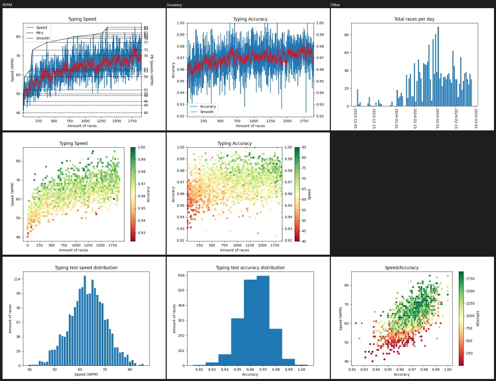

# TypeRacer-stats-scraper
Get the statistics of TypeRacer players and plot them into a dashboard.
## Dependencies
beautifulsoup4  
lxml  
requests  
matplotlib.pyplot  
## Example Code

```python
from GraphMaker import GraphMaker
from StatsScraper import StatsScraper

ss = StatsScraper("skyprompdvorak")
gm = GraphMaker(ss.getData())

gm.plotWPM()
gm.plotAccuracy()
gm.plotWPMAccCorrelation()
gm.plotAccWPMCorrelation()
gm.plotDailyRaces()
gm.histWPM()
gm.histAccuracy()
```
## Result
