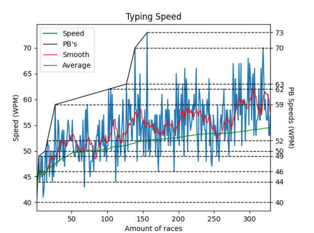

# TypeRacer-stats-scraper
Get the statistics of TypeRacer players
## Dependencies
beautifulsoup4  
lxml  
requests  
matplotlib.pyplot  
## Example
```python
from TypeRacer import TypeRacer


tr = TypeRacer("skyprompdvorak")

tr.plotWPM(pb_smooth_on=True, denoising_line=10, average_on=True)
tr.plotAccuracy(denoising_line=10, average_on=True)
tr.histWPM()
tr.histAccuracy()
```


