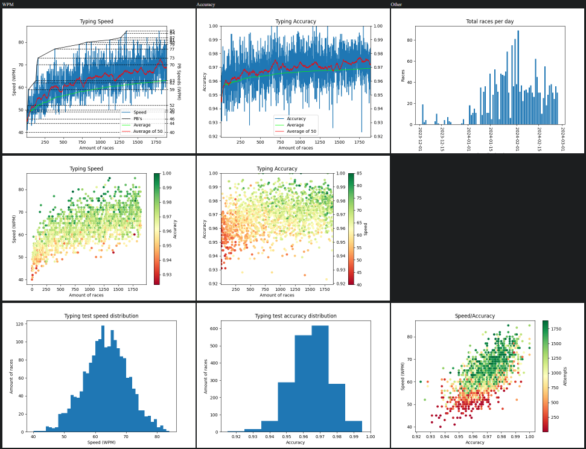

# TypeRacer-stats-scraper
Get the statistics of TypeRacer players and plot them into a dashboard.
## Dependencies
beautifulsoup4  
lxml  
requests  
matplotlib.pyplot  

### Install requirements
```shell
pip install -r requirements
```
## Example Code

```python
from GraphMaker import GraphMaker
from StatsScraper import StatsScraper

ss = StatsScraper("skyprompdvorak")
gm = GraphMaker(ss.getData())

smoothing = 50

gm.plotWPM(average_grouping=50)
gm.plotAccuracy(average_grouping=50)
gm.plotWPMAccCorrelation()
gm.plotAccWPMCorrelation()
gm.plotDailyRaces()
gm.histWPM()
gm.histAccuracy()

gm.animateHistAccuracy()
gm.animateHistWPM()

ss2 = StatsScraper("typeracer")
gm2 = GraphMaker(ss2.getData())

gm.overlapWPM(gm2, cutoff=True, self_name="skyprompdvorak", other_name="typeracer")
```
## Result
